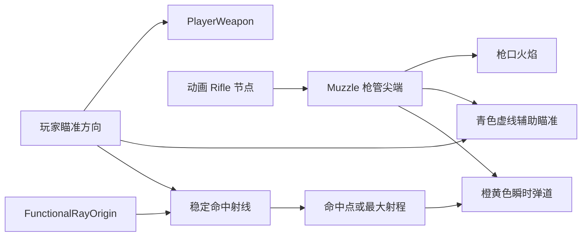

# 枪口、辅助瞄准线与弹道线修复设计

## 背景

当前玩家场景同时存在常驻的橙色 `AimIndicator` 和射击时生成的橙黄色 `ShotTracer`。两者都是连续发光线段，导致辅助瞄准线看起来像一条没有消失的枪火弹道。

射击反馈还使用了两个不同的起点：枪口火焰挂在跟随 Rifle 动画的 `Muzzle` 下，曳光弹则从独立的 `FunctionalRayOrigin` 开始。该功能射线原点只在初始化时复制枪口位置，而且当前枪口偏移沿 Rifle 局部 `-Z` 设置；实际 Rifle 网格的枪管长轴沿局部 `+X`，因此火焰和弹道都没有稳定落在枪管尖端。

## 目标

- 保留常驻辅助瞄准线，并让它与射击弹道在颜色、形状、长度和生命周期上明显不同。
- 辅助瞄准线使用短、细、半透明的青色虚线，长度约 `2.4` 米。
- 射击弹道使用明亮橙黄色实线，从枪口延伸到命中点或最大射程，并在约 `0.08` 秒内消失。
- 枪口火焰、辅助瞄准线和射击弹道都从 Rifle 的真实枪管尖端开始。
- 命中判定继续使用不受动画和视觉后坐影响的稳定射线原点。
- 保留现有弹道对象池、射速、伤害、辅助瞄准和命中反馈行为。

## 非目标

- 不删除辅助瞄准线。
- 不把辅助瞄准线改为全距离激光或准星系统。
- 不改变玩家朝向、键盘控制、射击射程或命中判定规则。
- 不让枪械动画或视觉后坐改变实际射击精度。
- 不更换 Rifle 模型、枪口火焰资源、弹道材质体系或射击音效。
- 不重构其他角色、僵尸或场景视觉效果。

## 根因

### 辅助瞄准线和弹道线缺乏视觉区分

`Player.tscn` 中的 `AimIndicator` 是一条始终可见的橙色发光 `BoxMesh`。`ShotTracer.tscn` 也是橙黄色发光 `BoxMesh`。即使弹道对象能按时隐藏，玩家仍会看到一条几乎相同的常驻线，因此容易判断为弹道残留。

### 枪口使用了错误的模型局部轴

Rifle 网格的顶点范围显示，枪管尖端位于 Rifle 局部 `+X` 端。尖端顶点集中在约：

```text
X: 0.763 ～ 0.802
Y: 0.279 ～ 0.341
Z: 0.572 ～ 0.638
```

当前 `muzzle_anchor_offset = Vector3(0, 0, -0.55)` 沿错误轴放置枪口。修复后使用显式的 Rifle 局部枪口标记，目标偏移约为 `Vector3(0.84, 0.31, 0.61)`，在网格尖端外留出少量距离，避免火焰和线段嵌入枪管。

### 视觉弹道错误复用了功能射线原点

`FunctionalRayOrigin` 的用途是提供稳定命中判定，不跟随 Rifle 动画和视觉后坐。当前曳光弹也从该点开始，导致视觉弹道无法与实时枪口位置重合。功能射线与视觉弹道需要保留各自职责。

## 设计

### 枪口锚点

`PlayerWeapon` 继续绑定动画模型中的 `Rifle` 节点，并让 `Muzzle` 使用 Rifle 局部坐标。将默认 `muzzle_anchor_offset` 修正为约 `Vector3(0.84, 0.31, 0.61)`，使其位于 Rifle 局部 `+X` 方向的枪管尖端外侧。

`Muzzle` 成为所有射击视觉反馈的唯一空间起点：

- `MuzzleFlash` 保持为 `Muzzle` 子节点。
- 辅助瞄准线每帧读取 `Muzzle.global_position`。
- `ShotTracer.setup()` 使用开枪瞬间的 `Muzzle.global_position`。

若运行时没有找到 Rifle 视觉节点，`PlayerWeapon` 保持场景内原有变换作为回退，不新增崩溃路径。

### 辅助瞄准线

将当前单根橙色 `AimIndicator` 替换为一个由五个短 `BoxMesh` 段组成的 `AimIndicator` 根节点：

- 颜色：偏青色。
- 材质：无阴影、自发光、半透明。
- 形状：五段短虚线，段间留出明显间隔。
- 总长度：约 `2.4` 米。
- 粗细：明显细于射击弹道。
- 生命周期：玩家存活时持续显示，玩家死亡后隐藏。

`AimIndicator` 使用顶层空间变换。每帧把根节点移动到实时枪口位置，并根据 `aim_direction` 朝向实际瞄准方向。这样它的起点能跟随枪口动画和后坐，但方向不会被 Rifle 局部旋转或动画姿势带偏。

### 命中射线与射击弹道

射击时保留两套起点：

1. **功能起点**：`FunctionalRayOrigin.global_position`，用于物理射线、辅助瞄准选择和伤害判定；该点不受 Rifle 动画和视觉后坐影响。
2. **视觉起点**：开枪瞬间的 `Muzzle.global_position`，用于枪口火焰与 `ShotTracer`。

物理射线先从功能起点解析最终命中位置。之后从视觉起点到该位置绘制橙黄色弹道。弹道仍由现有对象池复用，显示约 `0.08` 秒后淡出并停用。

如果视觉起点与命中点距离过短，沿用 `ShotTracer` 当前的安全停用逻辑，不显示零长度网格。

### 数据流



### 组件边界

- `player_controller.gd` 负责查找 Rifle、建立视觉绑定、维护玩家存活状态及提供瞄准输入。
- `player_weapon.gd` 负责枪口锚点、辅助线空间同步、功能射线和射击视觉触发。
- `Player.tscn` 负责辅助瞄准虚线的网格与材质结构，以及枪口、音效和功能射线节点装配。
- `shot_tracer.gd` 继续负责单条弹道的摆放、缩放、淡出和停用。
- `ShotTracer.tscn` 继续提供共享弹道网格和材质，不增加运行时资源创建。

## 错误处理与边界情况

- Rifle 节点缺失时，不访问空引用；武器保留场景默认位置作为视觉回退。
- `aim_direction` 为零向量时，沿用 `WeaponMath.flat_direction()` 的稳定默认方向，不调用无目标的 `look_at()`。
- 命中点与视觉枪口距离小于最小阈值时，弹道立即停用，避免零长度缩放。
- 对象池中的弹道再次获取时，`setup()` 必须覆盖其变换、透明度、剩余时间和处理状态。
- 玩家死亡时隐藏辅助瞄准线并停止继续射击；已经显示的弹道仍按自身极短生命周期正常结束。

## 测试策略

### 自动化测试

先添加会失败的回归测试，再修改生产代码：

- Rifle 绑定后的 `Muzzle` 局部位置接近约 `Vector3(0.84, 0.31, 0.61)`，而不是原来的局部 `-Z` 偏移。
- 辅助瞄准线存在、默认可见，包含多个分离线段，并使用与橙黄色弹道不同的青色半透明材质。
- 辅助瞄准线更新后，其世界起点与 `Muzzle.global_position` 重合，前向与注入的 `aim_direction` 一致。
- Rifle/视觉后坐移动后，功能射线原点保持稳定，但视觉枪口与辅助线同步移动。
- `ShotTracer.setup(from, to)` 后，网格的近端与传入的 `from` 重合；超过生命周期后弹道隐藏并停用处理。
- 弹道池持续复用共享网格和材质，重复射击不增加武器子节点数量。
- 玩家死亡后辅助瞄准线隐藏。

### 手动验收

- 启动 Demo，未开枪时能看到短、细、半透明的青色虚线辅助瞄准。
- 辅助线从 Rifle 枪管尖端开始，并始终指向玩家当前朝向。
- 开枪时枪口火焰和明亮橙黄色弹道同时从枪管尖端出现。
- 弹道延伸到命中点或射程终点，并在约 `0.08` 秒内消失；停止射击后不残留橙色线。
- 连续射击时辅助线保持稳定，弹道可以短暂叠加但不会永久存在。
- 移动、转向、跑步动画和后坐过程中，枪口视觉仍贴合枪管尖端。
- 命中位置、射速、伤害、辅助瞄准和相机后坐与修复前一致。

## 验收标准

1. 玩家存活且未开枪时，只持续显示短青色虚线辅助瞄准，不显示橙黄色弹道。
2. 每次开枪都从 Rifle 枪管尖端显示枪口火焰和橙黄色弹道。
3. 射击弹道在约 `0.08` 秒后自动隐藏，不留下常驻枪火线。
4. 辅助线起点随实时枪口移动，方向对应实际瞄准方向。
5. 功能射线不受 Rifle 动画和视觉后坐影响，命中行为无回归。
6. 弹道对象池继续复用，持续射击不会增长场景节点数量。
7. 自动化测试全部通过，手动视觉验收通过。
