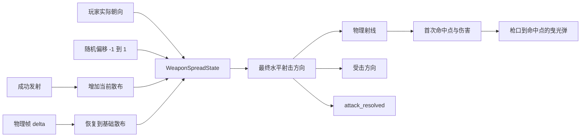

# 连射递增随机弹道散布设计

## 背景

当前远程武器从胶囊枪口端点发出水平物理射线，射线方向完全等于玩家实际朝向，因此每发弹道都是稳定直线。手枪和步枪已经有视觉后坐与镜头冲击，但这些反馈不会改变真实命中方向，连续射击仍然保持相同精度。

项目曾经存在约 `5° / 18m` 的自动吸附逻辑，但该逻辑已在提交 `ef922a1` 中删除。当前实现没有自动吸附，本功能只增加随机弹道散布，不恢复目标选择或方向吸附。

## 目标

- 每发远程攻击都允许在当前散布角范围内产生随机水平偏转。
- 连续射击使当前散布逐步扩大，停止射击后按时间平滑恢复。
- 手枪和步枪使用独立、可配置的散布参数。
- 物理命中、伤害方向、曳光弹和攻击反馈使用同一个最终射击方向。
- 保持现有射速、伤害、射程、枪口位置、墙体阻挡、视觉后坐、镜头冲击、声音和弹道对象池行为。
- 明确未来自动吸附与随机散布的组合顺序，避免两个方向修正系统互相覆盖。

## 非目标

- 不恢复自动吸附、目标搜索或目标锁定。
- 不增加垂直俯仰散布、弹道下坠、飞行时间或实体子弹。
- 不实现固定后坐轨迹、玩家压枪输入、准星扩散 UI 或移动精度惩罚。
- 不改变近战武器。
- 不调整僵尸命中盒、生命值或受击倍率。

## 散布模型

每把远程武器维护一个独立的 `current_spread_degrees`。该值初始化为武器的基础散布，并始终被限制在基础散布与最大散布之间。

每次实际发射时按以下顺序处理：

1. 取得玩家当前实际朝向作为基础方向。
2. 从 `[-1.0, 1.0]` 生成一个随机归一化偏移。
3. 使用 `current_spread_degrees * normalized_random_offset` 得到本发水平偏转角。
4. 将基础方向绕世界 `Vector3.UP` 旋转该角度，得到最终射击方向。
5. 使用当前散布完成本发计算后，再增加 `spread_increase_per_shot_degrees`，并限制到最大散布。
6. 后续物理帧使用 `spread_recovery_degrees_per_second * delta` 将当前散布平滑恢复到基础散布。

偏转只发生在水平 XZ 平面。最终方向继续经过 `WeaponMath.flat_direction()` 归一化，避免引入垂直分量或零向量。

## 武器参数

`RangedWeaponDefinition` 增加以下资源字段：

- `base_spread_degrees: float`：武器完全恢复后的最小散布角。
- `max_spread_degrees: float`：连续射击时允许达到的最大散布角。
- `spread_increase_per_shot_degrees: float`：每次成功发射后增加的散布角。
- `spread_recovery_degrees_per_second: float`：每秒恢复的散布角。

首轮调校值如下：

| 武器 | 基础散布 | 最大散布 | 每发增加 | 每秒恢复 |
|---|---:|---:|---:|---:|
| 手枪 | `0.35°` | `3.0°` | `0.8°` | `1.8°` |
| 步枪 | `0.5°` | `5.0°` | `0.65°` | `1.5°` |

这些字段只影响水平射击方向，不改变现有 `visual_recoil_kick` 或 `camera_impulse_strength`。

## 组件边界

### `WeaponSpreadState`

新增 `scripts/combat/weapons/weapon_spread_state.gd`，使用 `RefCounted` 保存单把武器的散布状态。它只负责纯散布规则，不访问场景树、物理世界、输入或目标节点。

公开接口：

```gdscript
func _init(
	base_spread_degrees: float,
	max_spread_degrees: float,
	spread_increase_per_shot_degrees: float,
	spread_recovery_degrees_per_second: float
) -> void

func tick(delta: float) -> void
func resolve_shot_direction(
	base_direction: Vector3,
	normalized_random_offset: float
) -> Vector3
func reset() -> void
```

`resolve_shot_direction()` 使用调用前的当前散布计算本发方向，然后累积下一发散布。传入的随机偏移会限制到 `[-1.0, 1.0]`，从而保证任何调用者都不能产生超出当前散布锥的方向。

构造时对配置执行安全归一化：基础散布不小于零；最大散布不小于基础散布；单发增加量和恢复速度不小于零。`tick()` 对负数 `delta` 按零处理。

### `RangedWeapon`

`RangedWeapon` 在 `_ready()` 中使用武器定义创建 `WeaponSpreadState`，并持有一个运行时随机数生成器。

- `_physics_process(delta)` 先推进散布恢复，再通过现有 `WeaponTrigger` 判断是否真正发射。
- `_fire(shot_direction)` 在任何射线查询之前解析最终随机方向。
- 射线终点、`apply_hit()` 的方向参数和 `attack_resolved` 信号全部使用最终随机方向。
- 曳光弹继续连接枪口原点与该射线的首次命中点或射程终点，因此视觉弹道与真实命中一致。
- 武器卸下时重置散布到基础值；受伤、死亡或临时取消攻击只停止扳机输入，散布仍按正常恢复规则处理。

随机数只负责提供 `[-1.0, 1.0]` 的样本，所有角度限制与状态变化都由 `WeaponSpreadState` 完成。这样单元测试可以直接传入 `-1.0`、`0.0` 和 `1.0` 获得确定结果，无需模拟随机 API。

## 数据流



## 与自动吸附的兼容边界

当前代码没有自动吸附，因此本次实现不存在直接运行时冲突。

若未来恢复自动吸附，方向处理必须固定为：

```text
玩家基础方向 → 自动吸附得到中心方向 → 随机散布 → 物理射线
```

自动吸附只能修改散布前的中心方向，不能在散布后再次把方向改回目标中心。否则随机偏转会被吸附抵消，连续散布失去实际作用。

墙体阻挡仍然在最终随机方向上执行首次碰撞查询。即使吸附目标存在，墙体也不能被目标选择逻辑穿透。

## 状态生命周期

- 武器创建并进入场景时，当前散布等于基础散布。
- 每次成功通过射速门并实际执行 `_fire()` 时，散布增加一次。
- 仅按下但未通过射速门的输入不增加散布。
- 每个启用状态下的物理帧都会恢复散布，包括按住扳机时两发之间的时间。
- 武器切换为未装备状态时立即重置到基础散布。
- 重新装备时从基础散布开始。
- 单次受伤、攻击取消或松开扳机不会立即清零；只通过时间恢复。

## 测试策略

### 单元测试

新增 `tests/unit/test_weapon_spread_state.gd` 并注册到 `tests/test_runner.gd`，覆盖：

- 零随机偏移保持基础方向，但仍按单发规则增加下一发散布。
- `-1.0` 与 `1.0` 分别产生当前散布允许的两个边界方向。
- 连续发射将当前散布限制在最大值，不会继续增长。
- `tick(delta)` 按恢复速度下降，但不会低于基础散布。
- `reset()` 立即恢复基础散布。
- 非法负配置、最大值小于基础值、越界随机偏移和负 `delta` 都被安全限制。

### 武器配置测试

扩展 `tests/unit/test_weapon_configuration.gd`，验证手枪和步枪资源包含上述四个字段，并使用表格中约定的精确数值。

### 射击集成测试

扩展现有武器反馈和墙体弹道测试，验证：

- `attack_resolved` 发出的方向位于本发允许的散布范围内。
- 曳光弹终点与使用最终随机方向执行的首次物理命中点一致。
- 传给伤害目标的方向与反馈方向一致。
- 连续发射后允许角度扩大，恢复后回到基础范围。
- 墙体仍会截断发生偏转的射线，不能伤害墙后目标。
- 原有“不会自动弯向离轴目标”测试在重置散布后执行，继续证明没有恢复自动吸附。

既有“攻击方向必须与人物前向完全相同”的断言需要改为“攻击方向与人物前向的夹角不超过本发散布上限”，同时保留枪口原点、人物实际朝向作为散布中心、墙体首次命中和视觉/功能弹道一致性的契约。

## 验收标准

1. 手枪与步枪每发弹道均可能在各自当前散布范围内产生水平随机偏转。
2. 步枪持续以每秒 6 发射击时，弹道范围逐步扩大并最终受 `5.0°` 上限约束。
3. 停止射击后，步枪当前散布以每秒 `1.5°` 恢复，但不低于 `0.5°`。
4. 手枪使用 `0.35° / 3.0° / 0.8° / 1.8°每秒` 的独立参数。
5. 实际伤害、曳光弹和攻击反馈使用同一条随机偏转射线。
6. 随机偏转不产生垂直方向，不改变射程或伤害。
7. 墙体继续阻挡最终随机射线，墙后目标不受伤。
8. 当前实现不包含自动吸附；未来吸附必须发生在随机散布之前。
9. 新增单元测试、现有相关集成测试、完整 `./tests/run_tests.sh` 和 Godot 无头编辑器导入检查全部通过。
