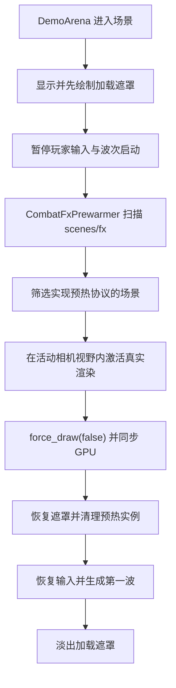

# 战斗特效渲染预热设计

## 背景

进入战斗后第一次开火会让整个游戏画面短暂冻结。冷启动探针表明，射线检测、弹道扩散和音频首播并不是主要瓶颈；真正的尖峰来自此前不可见的枪口火焰、曳光和血液 GPU 粒子第一次参与绘制时，在 GL Compatibility 渲染路径上同步编译 Shader 与粒子管线。

当前曳光对象池只预先实例化节点，随后立即将节点设为不可见，因此没有触发真实绘制。血液命中特效则在第一次命中时才实例化并启动粒子。结果是首发空枪会承担枪口火焰与曳光的编译成本，首次命中还会叠加血液粒子的初始化与编译成本。

## 目标

- 将战斗特效的首次渲染开销移动到进入战斗时的加载遮罩阶段。
- 第一发空枪和首次命中不再出现可感知的整帧冻结。
- 新增的战斗特效可以通过统一约定自动参与预热，无须修改中央硬编码列表。
- 预热不得触发真实攻击、伤害、音频、后坐力、弹道散布增长或波次状态变化。
- 预热失败时允许游戏继续进入，不能永久停留在加载画面。
- 在 `AGENTS.md` 中记录新增战斗特效的预热开发约定，使后续开发获得明确提示。

## 非目标

- 本次不重写现有特效的视觉表现。
- 本次不引入通用对象池框架；首次编译被搬到加载阶段后，血液特效后续实例化开销较小。
- 本次不依赖显卡驱动缓存作为正确性保障。
- 本次不扫描和实例化项目中的所有场景，只处理约定目录下主动声明可预热的特效。
- 本次不为难以稳定自动化的 GPU 编译耗时设置脆弱的固定毫秒断言。

## 方案比较

### 方案 A：加载遮罩下真实渲染预热（采用）

进入战斗场景后先显示不透明加载遮罩，再在活动相机视野内临时绘制需要预热的特效。预热时使用不交换前台缓冲的强制绘制并同步 GPU，完成后清理临时实例并开放游戏。

优点是能够触发与真实游戏相同的 Shader、光照材质和粒子绘制路径，跨开发环境与导出版本都容易验证。实测 M1 Pro 的 GL Compatibility 冷启动会增加约 `1.3–1.4` 秒加载等待，具体时间随设备和驱动变化。

### 方案 B：简化或移除自定义 Shader 与 GPU 粒子

使用更简单的材质或 CPU 视觉代替现有效果。该方案会牺牲视觉质量，而且新的材质组合仍可能产生首次编译，不作为当前问题的首选。

### 方案 C：依赖驱动或引擎 Shader 缓存

缓存行为受到平台、驱动、构建模式和渲染后端影响。当前 GL Compatibility 冷启动测量已经证明现有缓存不能可靠避免首次绘制阻塞，因此只把缓存视为辅助优化。

## 总体架构

新增一个职责单一的战斗特效预热器，由 `DemoArena` 在启动流程中调用。预热器负责发现、加载、实例化、激活和清理可预热特效；`DemoArena` 负责加载遮罩、游戏输入与波次开放时机。

## 自动发现与预热协议

### 扫描范围

预热器递归扫描 `res://scenes/fx/` 下的 `.tscn` 文件。扫描范围固定在特效目录，避免误加载角色、关卡或 UI 场景。

### 主动声明

预热器加载候选 `PackedScene` 并创建离树实例，仅当场景根节点实现以下方法时才加入预热：

- `warmup_for_render(context: FxWarmupContext) -> void`
- `finish_render_warmup() -> void`

没有实现协议的场景立即释放，不进入场景树，也不执行 `_ready()`。新增特效只需要放入 `scenes/fx/` 并实现协议，不需要修改预热器、注册表或关卡脚本。

### 预热上下文

`FxWarmupContext` 提供活动相机、临时父节点、相机前方向和安全预热位置。特效自身负责以不会影响玩法的方式进入真实绘制状态，例如：

- 曳光设置一条位于相机前方的短轨迹并显示 Mesh。
- 枪口火焰显示一次 QuadMesh。
- 血液特效启动一次 GPU 粒子并显示血点 Sprite3D。

预热协议不得播放音频、发出攻击信号、修改生命值或访问真实目标。

## 战斗启动流程

`DemoArena` 的加载遮罩在场景文件中默认可见，并位于高层级 `CanvasLayer`，覆盖 HUD 和移动端控件。

启动顺序如下：

1. 子节点完成 `_ready()` 后，`DemoArena` 暂停玩家物理输入并阻止手动刷怪。
2. 保持第一波尚未生成，减少预热阶段的无关工作。
3. 等待两个普通进程帧，保证不透明遮罩已经呈现到屏幕。
4. 临时隐藏遮罩节点，但不交换前台缓冲；屏幕继续保留上一帧的不透明加载画面。
5. 调用预热器，让声明了预热协议的特效在活动相机视野内真实绘制，并执行 `RenderingServer.force_draw(false)` 与 `force_sync()`。
6. 恢复遮罩节点，调用所有实例的 `finish_render_warmup()`，随后从场景树移除并释放临时实例。
7. 释放残留输入状态、恢复玩家控制并生成第一波僵尸。
8. 淡出并隐藏加载遮罩。

不直接调用武器 `_fire()`，避免音频、弹道散布、射线命中、伤害、后坐力与攻击反馈等副作用。

## 组件改动

### `scripts/fx/combat_fx_prewarmer.gd`

- 递归发现 `scenes/fx/` 中的候选场景。
- 安全加载并识别预热协议。
- 在临时父节点下管理预热实例生命周期。
- 汇总加载或协议执行错误，但始终完成清理并返回控制权。

### `scripts/fx/fx_warmup_context.gd`

- 封装活动相机、临时父节点和相机前方的安全渲染位置。
- 避免各特效重复计算视野内预热坐标。

### 现有特效脚本

`ShotTracer`、`MuzzleFlash`、`BloodImpact` 与 `GroundBloodSplat` 实现统一预热协议。协议方法复用其真实显示、材质或粒子启动路径，但不调用任何玩法入口。

### `DemoArena`

- 新增加载遮罩与加载提示。
- 将当前 `_ready()` 中立即执行的 `spawn_wave()` 延后到预热结束。
- 预热期间阻止玩家物理输入和刷怪操作。
- 即使预热器报告部分特效失败，也必须恢复游戏并移除遮罩。

### `AGENTS.md`

增加“战斗特效预热约定”：

- 新增需要在战斗中首次显示的 Mesh、Shader、粒子或动画特效时，场景放在 `scenes/fx/`。
- 根节点实现统一预热协议，使其自动被 `CombatFxPrewarmer` 发现。
- 预热方法必须只触发视觉渲染，不得产生声音、伤害、输入、存档或其他玩法副作用。
- 新增特效测试需验证协议存在及预热后可以恢复初始状态。

## 错误处理

- 单个场景加载失败、类型不匹配或预热方法报错时记录包含资源路径的错误并继续其他特效。
- 活动相机缺失时跳过视觉预热，执行清理并继续进入游戏。
- 清理过程对已经释放或未加入场景树的实例保持幂等。

## 测试策略

### TDD Smoke Test

本功能按低至中等风险处理，只实现覆盖核心路径的 TDD Smoke Test，不追求完整单元测试或覆盖率：

- 先增加一个失败的预热冒烟测试，确认扫描器能自动发现 `ShotTracer`、`MuzzleFlash`、`BloodImpact` 与 `GroundBloodSplat`，且这些场景都实现统一预热协议。
- 确认 `DemoArena` 提供默认可见的高层加载遮罩，并挂载预热器。
- 在 Headless 环境调用协议的最小生命周期，确认实例能够完成激活与清理，不产生脚本错误。
- 运行现有完整测试套件和 Godot Headless Editor 解析检查，避免场景与脚本回归。

不为每个异常分支、目录遍历细节或 GPU 时序编写额外自动测试。玩法无副作用通过协议边界、代码审查和固定冷启动样例验证。

### 人工冷启动验收

GPU Shader 编译尖峰难以在 Headless 环境稳定验证，按项目测试约定采用人工冷启动验收：

1. 完全退出 Godot 运行实例后重新启动游戏。
2. 从主菜单进入战斗，确认加载遮罩覆盖预热等待。
3. 加载遮罩消失后立即空枪射击，确认画面无明显冻结。
4. 首次命中僵尸，确认画面无明显冻结。
5. 使用 Godot Profiler 或临时冷启动探针对比首发渲染帧尖峰。

## 验收标准

- 冷启动进入战斗时，首次特效编译发生在不透明加载遮罩后方。
- 第一发空枪与首次命中不再产生可感知的整画面冻结。
- 新增符合目录和协议约定的特效无需修改中央列表即可参与预热。
- 预热不会产生攻击、伤害、声音、弹道散布增长或波次提前生成。
- 任一特效预热失败时，游戏仍能在有限时间内进入可操作状态。
- `AGENTS.md` 明确记录后续战斗特效的自动预热开发约定。
