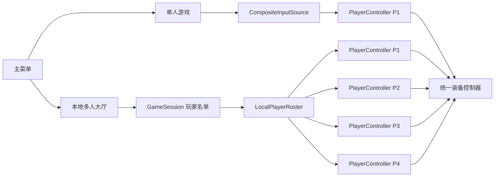
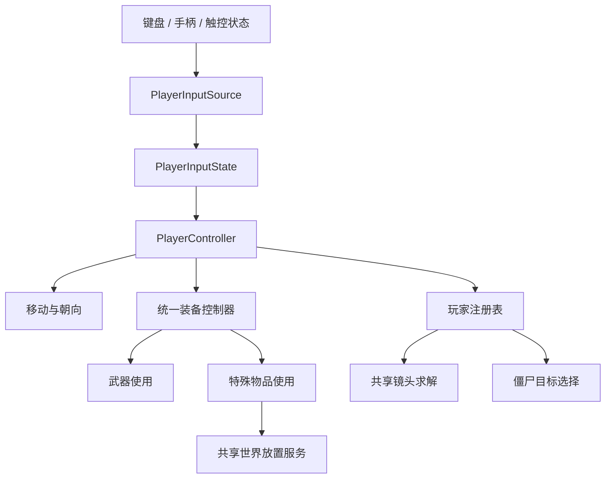

# 本地多人输入与共享镜头设计

**日期：** 2026-08-07

**状态：** 已确认

**范围：** 单人兼容、本地键盘与手柄加入、最多四名玩家、统一装备循环、真实 3D 多人大厅、共享镜头、多人选敌和失败状态

## 背景

项目当前是单玩家 Godot 4.7.1 2.5D 战斗原型：

- `PlayerController` 直接读取全局 InputMap。
- `DemoArena` 预放一个 `Player`，镜头始终跟随该玩家并将其居中。
- `EquipmentController` 只管理武器槽位。
- 放置油桶使用独立 `place_item` 动作和场景级库存。
- 僵尸由场景固定绑定到唯一玩家。
- 主菜单只有开始游戏和退出游戏。
- 移动端通过虚拟摇杆、开火键和独立放置键驱动现有 InputMap。

新需求要求先建立本地多人架构。最多四名玩家可以由两套键盘分区或不同设备 ID 的手柄加入。后续网络玩家和触屏多人应能复用同一玩家输入边界，但不在本次交付范围内。

## 目标

1. 主菜单区分单人游戏和本地多人游戏。
2. 本地多人大厅允许两套键盘和多个手柄按加入顺序占用 P1-P4。
3. 单人模式继续允许全部本地输入设备共同控制 P1。
4. 每名本地多人玩家拥有独立输入、生命、装备选择和特殊物品库存。
5. 武器与特殊物品进入统一循环装备列表，统一使用主操作键。
6. 战斗场景支持生成一至四名玩家。
7. 僵尸在多个玩家之间选择最近的有效目标。
8. 共享镜头只移动位置，按玩家中心和边缘推动计算目标，不缩放、不旋转、不改变高度。
9. 多人大厅使用真实角色模型，不使用方块卡片或 2D 人形占位。
10. 保留并更新触控单人模式，不让当前移动端玩法失效。

## 非目标

- 网络同步、网络权限和网络大厅。
- 战斗中热加入。
- 按键重映射。
- 玩家之间的直接武器伤害。
- 复活、救援和中途重生。
- 根据玩家数量调整僵尸数量、生命或难度。
- 触屏作为独立本地多人玩家加入。
- 分屏、动态分屏、镜头缩放和镜头旋转。
- 其他手柄接管断线玩家。

## 总体架构

采用“设备级输入源 + 玩家输入上下文”。玩家控制器不再直接读取全局 InputMap，而是消费注入的输入源。



### `GameSession`

新增轻量 Autoload，负责跨场景保存本局模式和玩家名单，不直接读取实时输入。

建议数据：

```gdscript
enum Mode {
	SINGLE,
	LOCAL_MULTIPLAYER,
}

class LocalPlayerDescriptor:
	var player_index: int
	var source_kind: int
	var gamepad_device_id: int
```

`source_kind` 至少包含：

- `KEYBOARD_WASD`
- `KEYBOARD_ARROWS`
- `GAMEPAD`

单人模式不保存四个独占来源，而是由战斗场景创建组合输入源。返回主菜单时清空本地多人名单。

### `PlayerInputState`

每个物理帧使用统一输入快照：

```gdscript
class_name PlayerInputState

var move_vector := Vector2.ZERO
var previous_equipment_just_pressed := false
var next_equipment_just_pressed := false
var use_pressed := false
var use_just_pressed := false
var confirm_just_pressed := false
```

输入状态不包含场景节点、武器对象或网络状态。未来网络输入源只需产生相同快照。

### `PlayerInputSource`

输入源负责：

- 标识唯一输入来源。
- 采样移动向量。
- 维护按键边沿状态。
- 在手柄离线时返回零输入。
- 报告输入源是否在线。

具体实现：

- `KeyboardWasdInputSource`
- `KeyboardArrowsInputSource`
- `GamepadInputSource`
- `CompositeInputSource`
- `TouchInputSource`

`CompositeInputSource` 用于单人模式。它合并全部键盘、已连接手柄和触控输入：移动向量相加后限制长度，动作状态按逻辑或合并。相反方向会自然抵消。

输入源不产生瞄准向量，也不覆盖现有角色朝向或攻击方向逻辑。键盘、手柄左摇杆和触控摇杆只控制移动；装备使用继续接收 PlayerController 当前的角色朝向/攻击方向。

## 控制映射

### 键盘方案 1

- 移动：`W/A/S/D`
- 上一件装备：`Q`
- 下一件装备：`E`
- 使用当前装备：`Space`

### 键盘方案 2

- 移动：方向键
- 上一件装备：物理逗号键，界面显示 `<`
- 下一件装备：物理句号键，界面显示 `>`
- 使用当前装备：`/`

按物理键位置处理逗号和句号，不要求玩家按住 Shift。

### Xbox 手柄

- 移动：左摇杆
- 上一件装备：`LB`
- 下一件装备：`RB`
- 使用当前装备：`RT`
- 大厅加入：`A`
- P1 开始：`Menu/Start`
- 菜单确认：`A`
- 菜单返回：`B`
- 失败后重新开始：`A`

手柄移动使用正常移动死区。大厅加入使用更高的有效输入阈值，避免摇杆漂移自动加入。

## 场景流程

### 主菜单

主菜单操作改为：

1. 单人游戏
2. 多人游戏
3. 退出游戏

主菜单继续支持键盘、鼠标和手柄焦点导航。底部固定显示键盘和 Xbox 手柄菜单操作提示。

### 单人游戏

单人游戏直接进入战斗：

- 只生成 P1。
- P1 使用 `CompositeInputSource`。
- 两套键盘、所有已连接手柄和触控输入都可共同控制 P1。
- 不进入设备加入大厅。

### 本地多人大厅

新增本地多人大厅场景，包含四个玩家槽位和四个 3D 站位标记。

加入规则：

- 按任一 `W/A/S/D` 移动键时，键盘方案 1 加入。
- 按任一方向键时，键盘方案 2 加入。
- 未分配手柄按 `A` 时，以当前设备 ID 加入。
- 输入源按首次加入顺序占用最前面的空槽。
- 同一输入源不能重复加入。
- 玩家上限为四人。
- 至少一人加入后，只有 P1 可以开始游戏。
- P1 使用键盘时按 `Enter` 开始；使用手柄时按 `Menu/Start` 开始。
- 不支持单个玩家退出槽位。
- P1 使用 `Escape` 或 `B` 返回主菜单时，清空所有槽位。
- 战斗开始后不接受新的本地输入源加入。

手柄断开时：

- 保留原玩家槽位和设备 ID。
- 大厅状态显示“设备离线”。
- 只有相同设备 ID 恢复时重新在线。
- P1 离线时不能开始游戏。

## 真实 3D 多人大厅

大厅不使用四张方块卡片，也不使用 CSS 或 2D 人形占位。

### 场景构图

- 使用独立 3D 大厅背景，延续当前主菜单的暗色末日场景、红色警示灯和左侧文字层级。
- 四个玩家站位在世界中形成具有纵深的队伍构图，不做四等分 UI。
- 空槽位只显示地面站位标记、P 编号和加入方式。
- 玩家加入后才在对应站位生成真实角色预览。

### `LobbyPlayerPreview`

预览场景直接复用项目现有角色 GLTF 和真实动画资源，但不实例化完整战斗玩家逻辑。

预览职责：

- 显示真实角色模型。
- 显示默认步枪视觉。
- 播放持械待机动画。
- 在设备离线时保留模型并显示离线状态。

预览场景不加载：

- 玩家输入。
- 生命系统。
- 角色碰撞。
- 武器功能射线。
- 战斗装备逻辑。
- 3D 血条。

这样避免在大厅中运行不必要的物理、攻击和战斗信号。

## 战斗玩家生成

`DemoArena` 不再预放单一 `Player`。场景增加玩家容器和多个出生标记，由本地会话控制器生成一至四个 `Player.tscn`。

生成规则：

- 单人模式生成一个 P1。
- 本地多人模式按 `GameSession` 名单生成 P1-P4。
- 出生点位于当前出生区域附近的固定队形。
- 生成前检查世界碰撞，避免出生在静态障碍中。
- 所有出生点必须位于共享镜头初始安全区域内。
- 每个玩家绑定自己的输入源。
- 每个玩家拥有独立生命、装备控制器和特殊物品库存。

玩家继续使用碰撞层 2、掩码 1。玩家之间不发生实体碰撞，可以互相穿过，避免多人互相卡位。

## 玩家标记

每名玩家头顶长期显示：

- 玩家编号。
- 当前装备名称。
- 特殊物品剩余数量。

示例：

- `P1 · 手枪`
- `P2 · 步枪`
- `P3 · 刀`
- `P4 · 油桶 ×999`

切换装备或库存变化时立即更新。倒地后显示倒地状态。玩家模型不按 P 编号改颜色，血条也不增加玩家专属配色。

## 统一装备循环

### 目标

武器和特殊物品进入同一有序装备列表。玩家不再使用数字键直选武器，也不再使用独立放置键。

默认顺序：

1. 手枪
2. 步枪
3. 刀
4. 油桶

循环在首尾之间环绕。

### 装备接口

新增统一装备条目接口，至少提供：

- 绑定使用者和视觉上下文。
- 返回显示名称。
- 返回待机和移动动画。
- 装备和卸下。
- 接收 `use_pressed` 与 `use_just_pressed`。
- 取消未完成使用。
- 报告当前是否可选。
- 报告剩余数量，武器可返回无限或不显示数量。

现有武器适配该接口，保持当前攻击语义：

- 手枪每次刚按下只发射一枪。
- 步枪按住持续射击。
- 刀每次刚按下执行一次攻击周期。

放置类装备只响应 `use_just_pressed`。

### 切换规则

- `Q/LB/<` 选择上一件可用装备。
- `E/RB/>` 选择下一件可用装备。
- 切换时取消上一件装备未完成的攻击或使用。
- 数量为 0 的特殊物品不可选，循环时自动跳过。
- 当前特殊物品成功使用后数量变为 0 时，立即自动切换到下一件可用装备。
- 武器第一版始终可选。
- 如果配置错误导致没有任何可用装备，主操作无效并显示“无可用装备”。

### 独立库存与共享世界放置

每名玩家的放置类装备实例保存自己的库存。`DemoArena` 中每名玩家的油桶初始数量均为 999，数量互不共享。

当前 `PlaceItemController` 的职责拆分为共享世界放置服务：

- 计算目标网格。
- 检查保留格。
- 检查静态和动态阻挡。
- 生成放置物。
- 维护占用格和生命周期。
- 发出导航几何变化信号。

世界放置服务不再拥有玩家库存。放置类装备只有收到成功结果后才扣除自己的数量。失败原因继续可用于提示和测试。

## 触控单人兼容

触控本次不作为本地多人加入来源，但现有移动端单人模式必须保持可玩。

移动端控件改为：

- 虚拟摇杆。
- 上一件装备按钮。
- 下一件装备按钮。
- 使用当前装备按钮。

触控输入通过 `TouchInputSource` 产生与键盘和手柄相同的 `PlayerInputState`。触屏设备显示虚拟控件时隐藏桌面键盘和手柄操作说明。

正常游戏中“使用”按钮产生装备使用状态；进入全员倒地失败状态后，该按钮的按下边沿还映射为 `confirm_just_pressed`，供单人 P1 重新开始。离开失败状态后关闭该映射。

## 战斗 HUD

桌面战斗底部固定显示两行操作说明，不按最近输入设备切换，也不按玩家数量重复：

```text
键盘：WASD 移动 / Q E 切换 / Space 使用 | 方向键移动 / < > 切换 / / 使用
手柄：LS 移动 / LB RB 切换 / RT 使用
```

Xbox 按键使用统一徽标样式。相同手柄映射只显示一次。

所有玩家倒地后，中央显示失败状态，底部改为 P1 重新开始提示。

## 多人共享镜头

### 约束

- 摄像机只改变水平位置。
- 不处理缩放。
- 不处理旋转。
- 不改变高度。
- 镜头逻辑仅在本地计算，不保存到 `GameSession`，未来也不需要网络同步。

### 有效玩家

镜头计算只包含实例有效、存活且在线的玩家。

- 死亡玩家不参与。
- 手柄离线玩家不参与。
- 已移除或无效节点不参与。

手柄离线玩家仍保留在战斗中、输入归零并继续受到攻击，但其他在线玩家可能将镜头带离该角色。

### 目标计算

每个物理帧从玩家快照重新计算目标，不累计上一帧方向偏移。

令有效玩家集合为 `V`：

```text
玩家中心 C = V 中所有玩家世界位置的平均值
共同推动 P = 所有边缘推动贡献的汇总向量
目标位置 D = 限制到竞技场范围(C + 限长(P, 最大偏移))
```

最终公式：

```text
镜头目标位置 = 有效玩家中心点 + 玩家共同移动方向偏移
```

边缘推动贡献只在以下条件同时满足时产生：

1. 玩家接近屏幕边缘。
2. 玩家移动输入继续指向该边缘外侧。

单个玩家贡献权重由“边缘接近程度 × 向外输入强度”决定，范围限制为 `0.0-1.0`。

建议使用以下无累计公式：

```text
单人贡献 = 归一化世界移动方向 × 边缘接近程度 × 向外输入强度
原始共同推动 = 所有单人贡献之和 / 有效玩家数量
共同推动 = 原始共同推动 × 最大方向偏移距离
```

- 多名玩家同向时，贡献叠加，提高该方向的跟随权重。
- 玩家方向相反时，向量自然抵消。
- 无输入或向画面内部移动不产生边缘推动。
- 共同推动限制最大长度，避免镜头过度远离玩家中心。

目标计算应实现为纯函数式数学辅助。相同玩家快照和相同相机采样位置必须返回相同目标，不使用 `offset += contribution` 形式的累计状态。

### 平滑移动

目标求解完成后，再使用当前镜头位置、目标位置和 `delta` 做指数平滑。

平滑步骤本身不是幂等操作，但必须收敛到目标。镜头目标求解与平滑积分必须拆分，以便分别测试。

武器镜头冲击应用于相机视觉子节点，不修改共享镜头锚点、玩家中心或边缘推动状态。

屏幕边缘投影使用未叠加视觉冲击的共享镜头锚点。`VisualOffset` 只影响最终画面，不得进入玩家屏幕位置、屏幕移动方向或共同推动的采样计算。

### 屏幕安全边界

共享镜头保留外层安全区域：

- 在线且存活玩家的计划位移投影到屏幕坐标检查。
- 如果普通移动或击退会把玩家推出安全区域，只移除朝画面外的运动分量。
- 玩家仍可沿边界横向移动或向画面内部返回。
- 死亡和离线玩家不参与镜头与活动玩家安全约束，可能因镜头移动离开画面。
- 镜头锚点还需限制在竞技场允许的世界范围内。

## 僵尸多人选敌

场景维护当前玩家注册表。僵尸不再绑定固定的 `Player` 节点。

规则：

- 在感知范围内选择最近的存活玩家。
- 手柄离线但仍存活的玩家仍可成为目标。
- 当前目标死亡、无效或离开感知范围后立即重新选择。
- 当前目标仍有效时，只有新目标明显更近才切换，避免距离接近时来回抖动。
- 攻击前继续执行现有攻击距离、障碍和导航检查。
- 玩家倒地后不再成为新目标。

## 玩家死亡与失败

- 单个玩家倒地后留在场内。
- 倒地玩家停止输入、攻击和装备使用。
- 倒地玩家不参与镜头与僵尸选敌。
- 其他玩家继续战斗。
- 所有玩家倒地后才显示失败状态。
- 第一版不提供复活和救援。
- 失败后只有 P1 的输入源可以重新开始。

单人模式下 P1 使用组合输入源，因此 Enter、任一手柄 A 或触控“使用”按钮都可重新开始。多人模式下必须由 P1 对应的独占输入源触发：键盘 P1 使用 Enter，手柄 P1 使用 A。

## 手柄断线与恢复

战斗中手柄断开：

- 游戏不暂停。
- 玩家槽位、角色、生命、装备和库存全部保留。
- 玩家输入归零。
- 玩家仍会受到伤害并可被僵尸选择。
- 玩家不参与共享镜头计算。
- 只有相同设备 ID 恢复后重新启用输入和镜头参与。
- 其他未分配手柄不能接管。

## 数据流



## 异常处理

- 输入源描述无效：记录警告，对应槽位标记不可用，不让场景崩溃。
- 手柄离线：保留槽位，返回零输入，等待相同 ID 恢复。
- 相机没有有效玩家：保持最后位置，不计算空集合平均值。
- 装备条目无效：跳过并记录警告。
- 没有可用装备：主操作无效，显示“无可用装备”。
- 特殊物品放置失败：不扣库存。
- 大厅预览模型加载失败：保留站位与设备状态，记录警告，不阻止开局。
- 出生点被阻挡：尝试同一出生区域的备用偏移；任一会话玩家全部尝试失败时，显示场景初始化失败并返回上一界面，不能静默少生成玩家或生成到障碍内部。
- 玩家节点在运行时失效：从镜头和僵尸注册表移除。

## 验证策略

仓库当前没有持久自动化测试套件。本功能只为不随游戏手感调参频繁变化的稳定、高价值契约保留聚焦验证脚本，不恢复原 `tests/` 框架。

### 高价值契约验证

- 两套键盘映射互不串扰。
- 不同手柄设备 ID 互不串扰。
- 输入边沿状态只触发一次。
- 单人组合输入源正确合并多设备输入。
- 装备正向和反向循环。
- 零库存特殊物品被跳过。
- 当前特殊物品耗尽后自动切换。
- 放置失败不扣库存。
- 共享镜头玩家中心计算。
- 同向边缘推动叠加。
- 反向推动抵消。
- 最大偏移和竞技场范围限制。
- 死亡、离线和无效玩家排除。
- 相同快照产生相同镜头目标。
- 平滑移动收敛且不改变缩放、旋转和高度。
- 僵尸最近目标选择和切换迟滞。

### 场景与源码契约验证

- 主菜单包含单人、多人和退出操作。
- 大厅场景加载并拥有四个真实 3D 站位。
- 键盘方案 1、键盘方案 2 和手柄按顺序加入。
- 四人上限和重复加入保护。
- 只有 P1 能开始和返回清空。
- 手柄断开与相同 ID 恢复。
- 战斗按会话生成一至四名玩家。
- 玩家输入、生命、装备和库存相互隔离。
- 玩家之间可以穿过。
- 头顶标记长期显示玩家编号与当前装备。
- 僵尸能在多个玩家间重新选择目标。
- 单个玩家倒地不结束游戏。
- 全员倒地才显示失败。
- 只有 P1 可重新开始。
- 屏幕安全边界限制普通移动和击退。
- 触控单人模式可以移动、切换和使用装备。

### 静态与 Smoke Test

```bash
/Applications/Godot.app/Contents/MacOS/Godot --headless --editor --path . --quit
```

聚焦验证脚本使用独立命令运行，不新增全局测试运行器。例如：

```bash
/Applications/Godot.app/Contents/MacOS/Godot --headless --path . --script res://tools/validation/validate_local_input_contracts.gd
/Applications/Godot.app/Contents/MacOS/Godot --headless --path . --script res://tools/validation/validate_shared_camera_math.gd
```

### 人工验收

项目约定不使用 CUA 做全自动游戏验证。实现后由用户执行以下操作并提供截图或短视频：

1. 进入多人大厅，依次使用两套键盘和多个手柄加入。
2. 检查真实角色站位、待机动画、设备标签和离线状态。
3. 混合设备进行一至四人移动、装备切换、攻击和油桶放置。
4. 检查头顶玩家装备标记和固定底部操作说明。
5. 让玩家同向、反向和靠近不同屏幕边缘，检查共享镜头权重和稳定性。
6. 断开一个手柄，确认角色保留、继续受伤、镜头排除并等待相同 ID 恢复。
7. 逐个让玩家倒地，确认仅全员倒地后失败且 P1 可以重开。
8. 在触屏设备验证摇杆、前后切换和使用当前装备。

## 实施分层建议

该设计适合拆成连续实施阶段，但共享同一规格和输入契约：

1. 设备级输入源与 `PlayerController` 输入注入。
2. 统一装备循环与独立特殊物品库存。
3. 主菜单、本地多人大厅和 `GameSession`。
4. 多玩家生成、标记和战斗状态。
5. 僵尸多人选敌。
6. 共享镜头与屏幕安全边界。
7. 触控单人适配、UI 收尾和完整验证。

后续网络多人应新增网络输入源和网络玩家描述，不应让 `PlayerController` 重新读取全局 InputMap，也不应同步本地共享镜头状态。
