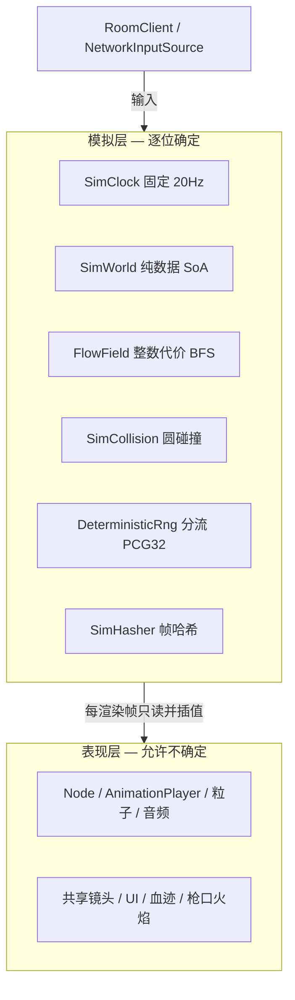
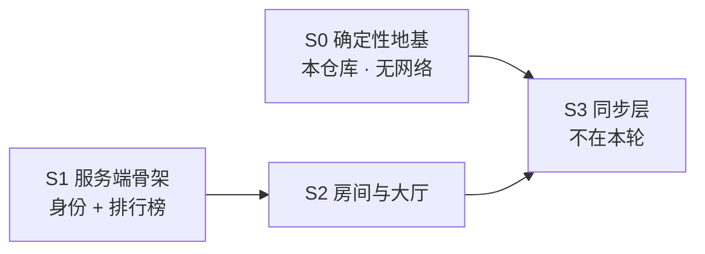
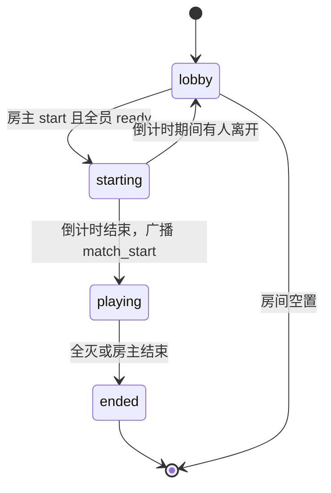
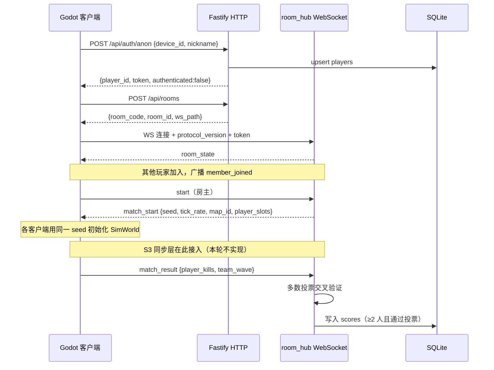

# 联机多人服务端设计（确定性地基 + 身份排行榜 + 房间大厅）

**日期：** 2026-08-07

**状态：** 已确认

**范围：** S0 确定性模拟地基、S1 独立服务端仓库与身份排行榜、S2 房间与大厅。不含 S3 同步层实现。

## 背景

项目当前是 Godot 4.7.1 2.5D 僵尸战斗原型，已完成本地多人：

- `PlayerInputSource` / `PlayerInputState` 把玩家输入抽象成可注入的设备无关接口。
- `GameSessionState` 保存本局模式与玩家名单，`LocalPlayerSpawner` 按 descriptor 列表生成 1-4 名玩家。
- `PlayerRegistry` 动态注册玩家，`LocalTeamState` 判定全灭，`ZombieTargetSelector` 让僵尸在多玩家间选最近目标。
- 共享镜头由 `SharedCameraMath` 计算，`PlayerScreenBounds` 把玩家限制在同一屏幕安全区内。
- 僵尸是独立 `CharacterBody3D` + `NavigationAgent3D`，通过 `NavigationWorldManager` 运行时分块烘焙导航网格。
- Web 导出 `variant/thread_support=false`，单线程运行，部署在 Cloudflare Pages + 私有 R2。
- 仓库无常驻自动化测试套件，改用 `tools/validation/*.gd` 一次性验证脚本。

本地多人设计文档（`2026-08-07-local-multiplayer-input-shared-camera-design.md`）已明确写下「后续网络玩家应能复用同一玩家输入边界」，本设计承接该接缝。

`htz-server` 是同级目录下已有的 Godot 4 多人原型后端，建立了 Node + TypeScript + Fastify + Vitest 的团队约定，以及「接口形状比实现更贵」的匿名身份模式。本设计沿用其工程约定，但**不复用其房间实现**：`htz-server` 的房间模型是房主上报 `ip:port` 后客户端走 ENet/UDP 直连、HTTP 服务退出；浏览器既无 UDP 也不能开监听端口，本项目的房间服必须全程转发游戏流量。

## 目标

1. 建立模拟层与表现层的硬分界，使僵尸、寻路、伤害结算在同一输入下逐位可复现。
2. 用确定性流场寻路与 MultiMesh 渲染，把同屏僵尸上限从个位数提升到 300。
3. 新建独立服务端仓库 `zombiewar-server`，Node + Fastify + TypeScript + SQLite。
4. 提供匿名设备身份，接口形状为将来接入平台账号预留。
5. 提供队伍波次榜与个人击杀榜，成绩只能由房间服写入，靠客户端多数投票交叉验证防刷。
6. 提供房间码建房、公开房间列表、WebSocket 大厅、心跳与断线重连。
7. 联机上限 4 人，沿用共享镜头，等价于把现有本地四人搬到线上。
8. 客户端网络输入源实现为 `PlayerInputSource` 的子类，玩家生成与战斗逻辑不因联机而分叉。
9. 首轮打通局域网本地 IP 直连，云部署押后。

## 非目标

- S3 同步层（tick 定序、玩家状态量化广播、不同步检测与恢复）的实现。本设计只预留接口与协议号段。
- 玩家角色物理的确定性化。玩家层保持现有 `CharacterBody3D` 与 `move_and_slide`。
- 战斗中热加入、复活救援、观战、回放（回放能力由 S3 的输入流附带获得，本轮不实现）。
- 快速匹配队列。首轮只有房间码与公开房列表。
- 真实账号鉴权、平台 SDK 接入、支付、防沉迷。
- 云部署、域名、CI/CD。首轮只跑局域网。
- 8 人房、独立镜头、分屏、兴趣区管理。
- 顶点动画纹理（VAT）方案。远景僵尸使用静态姿势。

## 总体架构

整个设计围绕一条分界线展开：**模拟层与表现层分离**。



规则是硬性的：模拟层中出现任何 `delta`、`randf()`、`move_and_slide()`、`NavigationAgent3D`、`get_tree()` 均视为缺陷。反之，`scripts/fx/` 下现有的表现随机全部保留，它们不影响模拟。

三个交付块的依赖关系：



S0 与 S1 互不阻塞，可并行推进。

---

# S0 确定性模拟地基

## 归属与目录

全部位于本仓库。新增两个目录：

- `scripts/sim/` — 模拟层。纯数据与纯函数，零 Node 依赖。
- `scripts/render/` — 表现桥接层。读取模拟状态并驱动渲染。

## `SimClock`

`scripts/sim/sim_clock.gd`

固定 20Hz 模拟节拍，与渲染帧率解耦。

```gdscript
const TICK_SECONDS := 0.05
const MAX_CATCHUP_TICKS := 5
```

累加器模式：每帧累加实际 `delta`，循环消费整数个 tick，单帧最多追赶 `MAX_CATCHUP_TICKS` 个以避免卡顿后的雪崩。

**模拟层函数一律不接收 `delta` 参数**，只使用常量 `TICK_SECONDS`。这是确定性的第一道闸门，也是最容易被无意破坏的一条。

选 20Hz 而非 60Hz 的理由：Web 导出单线程，300 僵尸的碰撞与流场查询要与渲染共用主线程；20Hz 把模拟开销降到 1/3，视觉差异由渲染插值补偿；50ms 的输入粒度对合作 PvE 可接受。

## `DeterministicRng`

`scripts/sim/deterministic_rng.gd`

自实现 PCG32，不使用 Godot 的 `RandomNumberGenerator`（其内部实现不保证跨版本稳定）。

按用途划分独立流，避免调用顺序耦合：

```gdscript
enum Stream {
	ZOMBIE_WANDER,
	ZOMBIE_SPAWN,
	WEAPON_SPREAD,
	LOOT_DROP,
}
```

每条流独立持有 state，从房间种子加流 ID 派生初始 state。任一子系统增删调用不会移动其他子系统的随机序列。

需要迁移到确定性流的现有调用：

| 位置 | 现状 | 处理 |
| --- | --- | --- |
| `zombie_target.gd` 游荡 | `wander_rng.randf_range` | 迁入 `Stream.ZOMBIE_WANDER` |
| `ranged_weapon.gd` 弹道散布 | `spread_rng` + `randomize()` | 迁入 `Stream.WEAPON_SPREAD`，**移除 `randomize()`** |
| `ranged_weapon.gd` 射击音高 | `randf_range(0.97, 1.03)` | 保留，纯表现 |
| `scripts/fx/**` | 各类 `randf_range` | 全部保留，纯表现 |

## `FlowField`

`scripts/sim/flow_field.gd`、`scripts/sim/flow_field_grid.gd`

替代 300 个 `NavigationAgent3D`。

- XZ 平面整数网格，cell 边长 0.5–1.0（与 `PlaceItemGrid` 的网格语义对齐，但**独立实例**，不复用其占位状态）。
- 以所有存活玩家为源做**多源 BFS**，整数代价，生成到最近玩家的方向场。整数运算天然逐位确定，把最难确定性化的寻路问题直接消解。
- 僵尸只查自己所在 cell 的方向向量，寻路成本与僵尸数量无关。
- 重算时机：任一玩家跨越 cell 边界，或阻挡集合变脏。重算是同步且确定的，不使用异步烘焙。
- 静态阻挡（`TrafficBarrier`、`PlasticBarrier`、`Container`、`ExplosiveBarrel`）在场景加载时烘入代价网格。
- **任何运行时增删阻挡几何的系统都必须标脏对应 cell**：爆炸桶销毁、`PlaceItemService` 放置油桶、拾取箱消失。这与 `AGENTS.md` 现有的「必须标记导航块为脏」要求同源，只是标脏对象从导航块换成流场 cell。

僵尸只有两种移动状态：游荡（本地随机，不查场）与追击（查场）。目标选择沿用 `ZombieTargetSelector` 的语义，但改为在 `SimWorld` 的玩家快照上计算。

## `SimCollision`

`scripts/sim/sim_collision.gd`

替代僵尸的 `CharacterBody3D.move_and_slide()`。

- 僵尸建模为 XZ 平面上的圆 + 高度标量。2.5D 平地场景不需要斜坡与台阶解算。
- 僵尸之间的互推用空间哈希网格加速，**遍历顺序严格按实体 id 升序**，禁止依赖 Dictionary 迭代顺序。
- 僵尸与静态几何的碰撞查阻挡 cell，不调用 `PhysicsDirectSpaceState3D`。
- 僵尸与玩家的碰撞：玩家位置作为只读输入进入模拟，僵尸被玩家推开，玩家不被模拟层反推（玩家位移仍由玩家层的 `move_and_slide` 决定）。

### 玩家与僵尸的物理阻挡

僵尸退出 Godot 物理世界后，玩家的 `move_and_slide()` 将不再被僵尸身体阻挡，玩家会直接穿过僵尸。这是相对现状的行为倒退，必须显式处理。

方案：为**近景 LOD 的表现节点**保留一个仅用于玩家阻挡的碰撞体（碰撞层只与玩家交互，不参与僵尸自身移动、不参与导航、不参与射击判定），每 tick 由 `ZombieRenderer` 同步到模拟位置。远景僵尸不提供阻挡体——玩家不可能接触到远景僵尸，因为共享镜头保证所有玩家都在画面内，而近景 LOD 的选取半径覆盖整个活动区。

该碰撞体只影响玩家位移，**玩家位移不进入模拟层**，因此不引入不确定性。

## `SimWorld`

`scripts/sim/sim_world.gd`

结构化数组（SoA）保存全部模拟状态，不持有任何 Node：

```gdscript
var zombie_id: PackedInt32Array
var zombie_position: PackedVector2Array   # XZ
var zombie_height: PackedFloat32Array
var zombie_facing: PackedFloat32Array
var zombie_health: PackedInt32Array
var zombie_state: PackedByteArray
var zombie_target_slot: PackedByteArray
```

- 实体 id 由单调递增计数器分配，永不复用，保证跨客户端一致。
- 所有遍历按数组下标顺序，即 id 顺序。
- 玩家状态以量化后的快照进入 `SimWorld`（位置量化到毫米级整数），确保各客户端看到相同的玩家输入。

### 伤害结算进入模拟层

开火作为事件输入进入模拟：「第 T tick，槽位 S 用武器 W 朝方向 D 开火」。命中判定在 `SimWorld` 的僵尸状态上用确定性射线解算，不使用 `PhysicsDirectSpaceState3D`。这样各客户端必然得到相同的击杀结果，也是 S1 交叉验证防刷的前提。

需要一并迁入模拟层的既有逻辑：

| 现有实现 | 处理 |
| --- | --- |
| `ranged_weapon.gd` 弹道散布 | 散布量由 `Stream.WEAPON_SPREAD` 在模拟层生成。**开火事件只携带玩家的瞄准方向，不携带散布后的方向**，散布由各客户端各自确定性地算出 |
| `zombie_hitbox.gd` 头/躯干/侧身/腿部命中框 | 在 `SimWorld` 中表达为相对僵尸位置朝向的解析几何（胶囊/球段），由确定性射线求交，保留现有的分部位伤害与击退差异 |
| `hit_response_math.gd` 击退 | 已是纯函数，直接在模拟层调用；击退产生的位移由 `SimCollision` 解算 |
| `explosion_math.gd` / `explosion_resolver.gd` | 爆炸的波及判定与伤害衰减进入模拟层；爆炸的视觉与音效留在表现层 |
| `weapon_spread_state.gd` 渐进散布累积 | 属玩家状态，但影响命中结果，必须进入模拟层并随开火事件推进 |

`melee_attack_cycle.gd` 的近战命中窗口同理进入模拟层。玩家自身的移动、动画、相机、音频不受影响。

## `SimHasher`

`scripts/sim/sim_hasher.gd`

对世界状态计算 64 位 FNV-1a 哈希，直接消费浮点的 IEEE 位模式（不做量化，帧同步要求的是逐位一致而非近似一致）。

纳入哈希的字段：实体 id、位置、朝向、血量、状态、目标槽位、各 RNG 流的 state、当前 tick。

S0 阶段用于自测；S3 阶段用于周期性不同步检测。

## 表现层：`ZombieRenderer`

`scripts/render/zombie_renderer.gd`

`MultiMesh` 不支持骨骼动画，而现有僵尸是 GLTF + `AnimationPlayer`。采用**距离 LOD 混合**：

- 距共享镜头中心最近的约 30 只，实例化现有 `ZombieTarget` 场景，**仅作表现**：不再持有血量、不再 `_physics_process`、不再调用 `move_and_slide`，每帧从 `SimWorld` 读取位置朝向状态并播放对应动画。
- 其余全部走 `MultiMeshInstance3D`，静态姿势，只更新 transform。
- LOD 归属每 tick 重算，切换时做一次淡入以避免突兀。
- 渲染帧之间对 `SimWorld` 的上一 tick 与当前 tick 做线性插值。

**LOD 归属不进入模拟层**，它是纯表现决策，允许各客户端不同。

## 玩家活动区改为世界坐标

`PlayerScreenBounds.limit_motion()` 当前使用 `camera.get_viewport().get_visible_rect().size`，而 `project.godot` 配置为 `window/stretch/aspect="expand"`——**不同设备宽高比会得到不同的可视区域**。本地四人共用一块屏时无影响；联机时手机 20:9 与桌面 16:9 的玩家会获得不同的移动边界，这本身即是不同步源，与选用何种同步方案无关。

联机模式下，共享活动区改用**世界坐标的固定矩形**（镜头中心 ± 固定半宽半高，常量来自配置），不再做屏幕反投影。单人与本地多人模式保持现有行为不变，通过 `GameSessionState.mode` 分支。

## 与 AGENTS.md 的冲突处理

`AGENTS.md` 的「3D Runtime Navigation」一节要求场景级导航管理器与运行时异步分块烘焙。S0 后僵尸不再使用该体系，且异步烘焙的完成时机本身不确定，与确定性模拟互斥。

处理方式：

1. 僵尸寻路全量迁移到 `FlowField`。
2. `NavigationWorldManager` / `NavigationChunk3D` / `NavigationBakeState` 及其验证脚本**保留但标记退役**，待 S3 落地并确认无其他消费者后再删除。
3. **同步修订 `AGENTS.md` 该节**，写明「僵尸寻路使用确定性流场，运行时导航烘焙不参与模拟层」。此修订属于本设计的交付内容，不得静默进行。

## 开放问题：确定性回归测试与仓库测试方针的张力

仓库现方针是「无常驻自动化测试套件」（`AGENTS.md`「Testing Guidelines」，见提交 `851e86f`），改用 `tools/validation/*.gd` 一次性脚本。

但确定性模拟是少数真正需要**常驻回归**的对象：不同步是静默失败，一次无意的 `randf()` 或 Dictionary 遍历可能在数周后才暴露为联机对不上，且届时定位成本极高。

本设计**遵循现行方针**，把确定性验证实现为 `tools/validation/validate_sim_determinism.gd`，并在此记录该张力。是否为模拟层单独恢复常驻回归，留待实施阶段由项目所有者裁决。

## S0 验收

- `tools/validation/validate_sim_determinism.gd`：3000 tick × 300 僵尸，同一输入序列跑两遍，逐 tick 哈希序列完全相同。
- 同一脚本变换喂帧节奏（每次喂 1 tick 与每次喂 5 tick）跑，哈希序列仍相同。
- `tools/validation/validate_flow_field.gd`：阻挡变更后重算正确、不可达区域行为、多源 BFS 结果与朴素实现一致。
- 人工：手机 H5 上 300 僵尸稳定 30fps 以上；提供操作步骤与截图清单，不使用 CUA 自动化。

---

# S1 服务端骨架、身份与排行榜

## 仓库与技术栈

新建独立仓库 `/Users/liangpingbo/Desktop/4399/game/zombiewar-server`，与 `htz-server` 同级同风格。

- Node ≥ 20.11、TypeScript、Fastify 5、Vitest
- `@fastify/cors`、`@fastify/rate-limit`、`@fastify/websocket`
- **SQLite 单文件持久化**（`better-sqlite3`）

存储选择偏离 `htz-server` 的纯内存方案：排行榜重启不能丢，且需要按分数排序、分页、取每人最佳成绩，SQL 最省事且仍是零运维。

```
zombiewar-server/
├── protocol/
│   ├── PROTOCOL.md            含 PROTOCOL_VERSION
│   └── fixtures/*.json        消息样本与期望编码
├── src/
│   ├── server.ts              监听 0.0.0.0:8787
│   ├── app.ts                 Fastify 装配、CORS、rate limit
│   ├── config.ts              端口、CORS 白名单、ENFORCE_AUTH、DB 路径
│   ├── types.ts
│   ├── lib/
│   │   ├── sessions.ts        匿名身份与 token
│   │   ├── db.ts              SQLite 打开与迁移
│   │   ├── leaderboard.ts     榜单读写、交叉验证、合理性上限
│   │   ├── rooms.ts           房间状态机 — 纯逻辑，不引用 socket
│   │   ├── room_hub.ts        WebSocket 连接管理与广播 — socket 只在这层
│   │   └── protocol/          编解码
│   └── routes/
│       ├── auth.ts
│       ├── leaderboard.ts
│       └── rooms.ts
└── test/
```

`rooms.ts` 与 `room_hub.ts` 分离，使房间状态机能被 Vitest 直接单测而无需起真实 WebSocket。

## 跨仓库协议同步

两个仓库、两种语言，协议必然漂移。三条机制：

1. `zombiewar-server/protocol/` 是单一事实源，导出 `PROTOCOL_VERSION` 常量。
2. `protocol/fixtures/*.json`（消息样本与期望的二进制编码）**复制**一份到本仓库 `tools/validation/fixtures/protocol/`，两端各自跑编解码对拍。
3. **握手强制版本校验**：客户端连接必须携带 `protocol_version`，不匹配则服务端立即 close 并返回明确错误码与双方版本号。

第 3 条最关键——它把「两仓库悄悄漂移」从静默缺陷转为一次带明确信息的响亮失败。

不使用 git submodule：Godot 对 submodule 不友好，GDScript 也无法消费 TypeScript 类型。

## 匿名身份

沿用 `htz-server` 的「接口形状比实现更贵」模式。

`POST /api/auth/anon`

请求：`{ device_id: string, nickname: string }`

响应：
```json
{
  "player_id": "...",
  "token": "...",
  "authenticated": false,
  "auth_mode": "anonymous_device"
}
```

- 身份位置固定为 `Authorization: Bearer <token>`，将来接入平台账号时下游端点与游戏握手一行不改。
- `ENFORCE_AUTH` 开关默认 `false`，与 `htz-server` 一致；下游端点解析并记录 token 但不强制。
- 客户端 UI **必须依据 `authenticated` 字段显示「未认证」**，不得依据「拿到 token」显示「已认证」。
- 设备 ID 由客户端首次运行生成 UUIDv4，存 `user://identity.cfg`。Web 导出下 `user://` 落在 IndexedDB，无需 `JavaScriptBridge`。
- 昵称 2–12 字符，黑名单过滤，允许重名（以 `player_id` 区分）。

表：

```sql
players(player_id TEXT PRIMARY KEY, device_id TEXT UNIQUE, nickname TEXT,
        created_at INTEGER, last_seen INTEGER)
```

## 排行榜

两张榜：

| board | 含义 |
| --- | --- |
| `team_waves` | 队伍单局最高存活波次 |
| `player_kills` | 个人单局击杀数 |

```sql
scores(id INTEGER PRIMARY KEY, board TEXT, season INTEGER, player_id TEXT,
       room_id TEXT, value INTEGER, extra TEXT, created_at INTEGER);
CREATE INDEX idx_scores_rank ON scores(board, season, value DESC);
```

- `GET /api/leaderboard/:board?season=0&limit=100` — 每个 `player_id` 只取其最佳成绩。
- `GET /api/leaderboard/:board/me` — 需 token，返回本人最佳成绩与名次。
- 赛季字段预留，本轮固定 `season=0`。

### 成绩只能由房间服写入

**不存在公开的成绩提交端点。** 客户端无任何写榜路径。这是整个防刷设计的地基。

结算流程：

1. 对局结束，房内每个客户端各自上报 `match_result { player_kills: {slot: n}, team_wave: n }`。
2. `room_hub` 收齐后调用 `leaderboard.ts` 做**多数投票**。因为所有客户端跑同一份确定性模拟，正常情况下这些数字必然完全一致。
3. 有客户端偏离多数 → 丢弃其上报并记录日志（该客户端可能已不同步或被篡改）。
4. 全场分歧无多数 → 整局作废，不写榜，记录日志。
5. 通过投票后再叠加服务端合理性上限：单局波次 ≤ 200、击杀数 ≤ 波次 × 每波僵尸上限、对局时长下限。

### 1 人房不计分

单人房间无交叉验证对象，因此**不写入任何榜单**。客户端 UI 必须明示「至少 2 人才能上榜」。

这是匿名身份下唯一免费且有效的防刷手段的必然代价，属已知取舍。

## 客户端改动

| 文件 | 说明 |
| --- | --- |
| `scripts/net/net_config.gd` | base URL 可配置，`user://net.cfg` 覆盖，不硬编码 |
| `scripts/net/identity_store.gd` | 设备 ID 与 token 持久化到 `user://identity.cfg` |
| `scripts/net/api_client.gd` | `HTTPRequest` 封装、token 注入、超时与重试 |
| `scenes/ui/LeaderboardPanel.tscn` + `scripts/ui/leaderboard_panel.gd` | 双榜切换、分页、本人名次 |
| `scripts/menu/main_menu.gd` | 新增「排行榜」入口 |

## S1 验收

- Vitest：身份签发与校验、榜单排序与取最佳、多数投票的一致/偏离/全场分歧三条分支、合理性上限、1 人房不计分。
- `tools/validation/validate_api_client.gd`：请求构造、token 注入、错误分支。
- 人工：起服务后客户端匿名登录、查看双榜、确认 UI 显示「未认证」、确认不存在可用的成绩提交端点。

---

# S2 房间与大厅

## 容量与形态

- **上限 4 人**，与本地多人一致。
- 沿用**共享镜头**，联机等价于把现有本地四人搬到线上。
- **不支持战斗中热加入**，与本地多人 spec 的非目标一致。

共享镜头下，一名玩家的网络抖动会通过镜头与活动区边界影响全场。这是共享镜头形态的固有属性，与同步方案无关，属已知取舍。

## HTTP 接口

| 方法与路径 | 说明 |
| --- | --- |
| `POST /api/rooms` | 建房，返回 `{ room_code, room_id, ws_path }` |
| `GET /api/rooms` | 公开房间列表，分页；心跳超时的死房自动清理 |
| `POST /api/rooms/:code/join` | 校验可加入并返回一次性 ticket |

房间码为 6 位大写字母数字，排除易混字符。建房时可选公开或仅房间码可见。

## WebSocket

`WS /api/rooms/:room_id/ws?ticket=<ticket>`

握手首帧必须携带 `protocol_version` 与 token；版本不匹配立即 close。

### 大厅消息（JSON）

客户端到服务端：`join`、`set_ready`、`set_nickname`、`start`（仅房主）、`leave`、`ping`

服务端到客户端：`room_state`（全量成员与房间状态）、`member_joined`、`member_left`、`member_updated`、`start_countdown`、`match_start`、`error`、`pong`

`match_start` 负载：

```json
{
  "seed": 1234567890,
  "tick_rate": 20,
  "map_id": "demo_arena",
  "player_slots": [{"slot": 0, "player_id": "...", "nickname": "..."}]
}
```

`seed` 与 `tick_rate` 现在即下发，S3 直接使用，无需改协议。

### 游戏内消息（二进制）

本轮不实现，但**协议号段现在划定**：opcode `0x00–0x7F` 为大厅与控制消息，`0x80–0xFF` 整段预留给 S3 同步层。

## 房间状态机



状态机实现在 `rooms.ts`，为纯函数式转移，不引用任何 socket 对象，可直接单测。

## 心跳与断线

- 客户端每 5 秒发 `ping`，服务端 15 秒未收到判定掉线。
- `lobby` 状态下掉线直接移出席位。
- `playing` 状态下**保留席位 30 秒**，客户端可用 `session_token` 重连恢复原 slot；超时则该 slot 标记为已断开，对局继续。
- 房主掉线：`lobby` 状态下移交给最早加入的剩余成员；`playing` 状态下不移交，对局照常进行。

断线语义参考现有 `tools/validation/validate_local_disconnect_contract.gd` 对本地手柄断线的处理约定，保持行为一致。

## 客户端改动

| 文件 | 说明 |
| --- | --- |
| `scripts/net/room_client.gd` | `WebSocketPeer`、协议编解码、心跳、重连 |
| `scripts/net/network_input_source.gd` | **`extends PlayerInputSource`** — 联机接入的唯一接缝 |
| `scripts/net/online_player_descriptor.gd` | 提供 `create_input_source()`，供 `LocalPlayerSpawner` 原样消费 |
| `scripts/gameplay/game_session.gd` | 新增 `Mode.ONLINE_MULTIPLAYER` |
| `scenes/ui/OnlineLobby.tscn` + `scripts/menu/online_lobby.gd` | 镜像 `local_multiplayer_lobby.gd` 的结构与预览角色 |
| `scripts/menu/main_menu.gd` | 新增「联机」入口 |

`LocalPlayerSpawner.spawn_players()` **一行不改**：它按 descriptor 列表生成玩家，联机只需提供一份 `OnlinePlayerDescriptor` 列表。

## S2 验收

- Vitest：房间状态机全部转移分支、房间码碰撞、容量上限、心跳清理、重连恢复 slot、房主移交。
- `tools/validation/validate_protocol_codec.gd`：以共享 fixtures 对拍编解码。
- `tools/validation/validate_online_lobby_wiring.gd`：场景与源码契约。
- 人工：Mac 与手机同 WiFi 各开客户端，建房、输码加入、公开列表加入、互见昵称与准备状态、房主开局、全员收到相同 `seed`。

---

# 本地开发与联通路径

首轮目标是打通局域网本地 IP 直连，云部署押后。

- Fastify 监听 `0.0.0.0:8787`。
- 游戏页面与 WebSocket **同为 http**：页面 `http://<开发机 LAN IP>:<port>/index.html`，WebSocket `ws://<开发机 LAN IP>:8787`。撰写时开发机 LAN IP 为 `10.3.31.37`，但该地址由 DHCP 分配、会变化，因此客户端的 base URL **必须可配置**（`user://net.cfg` 覆盖，缺省值来自 `net_config.gd`），不得硬编码进业务代码。
- Web 导出 `variant/thread_support=false`，不需要 `SharedArrayBuffer`，因此 `http://<LAN-IP>` 这一非安全上下文不影响游戏运行。

**混合内容约束**：README 现有流程用 `https://zombiewar.devlocal.com` 打开游戏。HTTPS 页面连接 `ws://` 会被浏览器按混合内容拒绝。若需保留 https 流程，须新增一个 nginx 443 vhost 反向代理到 `127.0.0.1:8787` 并改用 `wss://`：

- 证书复用 `/opt/homebrew/etc/nginx/ssl2.conf`
- WebSocket 代理头参考现有 `vhost/bk/bk.conf`（`proxy_http_version 1.1`、`Upgrade`、`Connection "Upgrade"`）

本轮以**全 http 局域网直连**为主路径，nginx + wss 作为备选方案记录在服务端仓库 README。

---

# 数据流



---

# 异常处理

| 情况 | 行为 |
| --- | --- |
| 协议版本不匹配 | 服务端立即 close，返回错误码与双方版本号；客户端提示需更新 |
| ticket 无效或过期 | 拒绝 WebSocket 升级，客户端退回大厅 |
| 房间已满 | `join` 返回明确错误，公开列表刷新 |
| 客户端心跳超时 | 按房间状态分别移出席位或保留 30 秒 |
| 成绩投票全场分歧 | 整局作废不写榜，服务端记录日志 |
| 成绩超出合理性上限 | 丢弃该条，记录日志 |
| 1 人房结算 | 静默跳过写榜，客户端 UI 已提前告知 |
| 服务端不可达 | 客户端降级到单人与本地多人，主菜单联机入口显示离线状态 |
| SQLite 写失败 | 记录日志并向房间广播「成绩未保存」，不影响对局结束流程 |
| 模拟哈希不一致（S3） | 本轮不实现；协议预留 `desync_report` opcode |

---

# 验证策略

## 服务端（Vitest）

- `rooms.ts` 状态机全部转移分支，纯函数式，不起 socket。
- `leaderboard.ts` 多数投票的一致 / 单点偏离 / 全场分歧三条分支；合理性上限；1 人房跳过；每人取最佳。
- `sessions.ts` token 签发与校验、`ENFORCE_AUTH` 两种取值。
- 路由集成测试：auth、leaderboard、rooms 的成功与失败路径。
- 协议编解码对拍 `protocol/fixtures/*.json`。

## 客户端（`tools/validation/`）

| 脚本 | 覆盖 |
| --- | --- |
| `validate_sim_determinism.gd` | 3000 tick × 300 僵尸双跑哈希一致；变换喂帧节奏仍一致 |
| `validate_flow_field.gd` | 多源 BFS 正确性、阻挡变更重算、不可达区域 |
| `validate_sim_collision.gd` | 圆碰撞解算、遍历顺序稳定性 |
| `validate_deterministic_rng.gd` | PCG32 已知向量、分流独立性 |
| `validate_protocol_codec.gd` | 与服务端共享 fixtures 对拍 |
| `validate_api_client.gd` | 请求构造、token 注入、错误分支 |
| `validate_online_lobby_wiring.gd` | 场景与源码契约 |

## 静态与 Smoke Test

`/Applications/Godot.app/Contents/MacOS/Godot --headless --editor --path . --quit` 捕获导入与解析错误。

## 人工验收

不使用 CUA 自动化。需要用户执行并提供截图的项目：

1. 手机 H5 上 300 僵尸的帧率与观感（含近景骨骼动画与远景 MultiMesh 的衔接）。
2. Mac 与手机同 WiFi 建房、输码加入、公开列表加入、互见、房主开局。
3. 对局中断网重连恢复原 slot。
4. 双榜显示、本人名次、「未认证」标记、「至少 2 人才能上榜」提示。

---

# 实施分层建议

各块可独立验收，建议顺序：

1. **S1 服务端骨架**：新仓库、Fastify 装配、SQLite 迁移、身份、双榜读接口。可独立上线。
2. **S1 客户端**：`net_config` / `identity_store` / `api_client` / 排行榜面板 / 主菜单入口。
3. **S0 模拟地基**：`DeterministicRng` → `FlowField` → `SimCollision` → `SimWorld` → `SimHasher` → `ZombieRenderer` LOD → 活动区改世界坐标 → 修订 `AGENTS.md`。这是工作量与风险最大的一块，与前两步无依赖，可并行。
4. **S2 房间**：`rooms.ts` 状态机 → `room_hub` WebSocket → HTTP 路由 → 客户端 `room_client` / `network_input_source` / `OnlineLobby`。
5. **S1 成绩写入**：`match_result` 上报、多数投票、写榜。依赖 S2 的房间生命周期。

S3 同步层单独立项，前置条件是 S0 的确定性验收通过且 S2 的房间可稳定承载 4 人。
